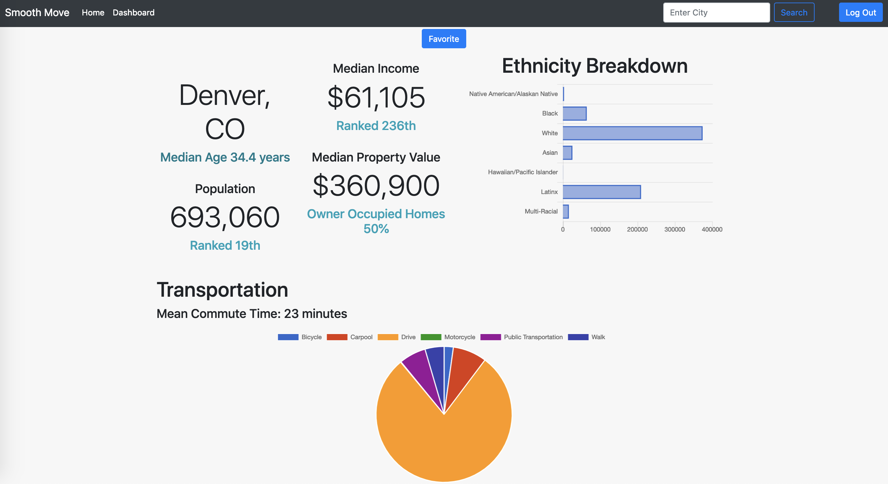
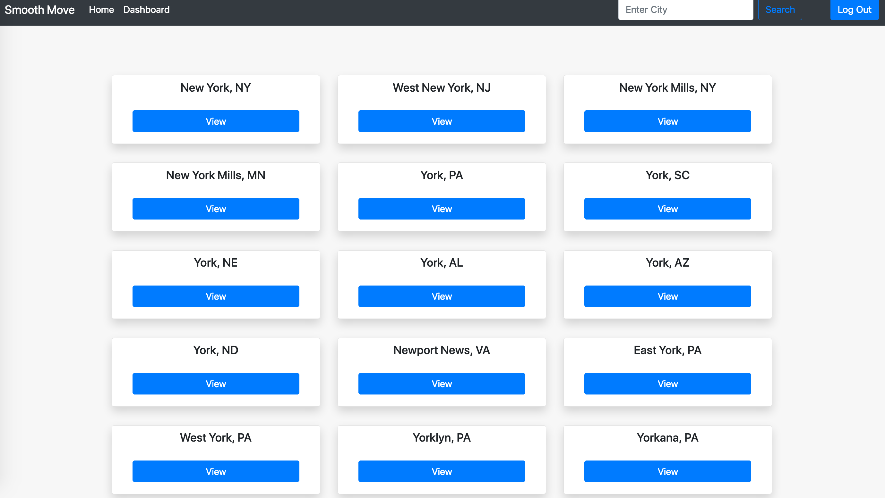
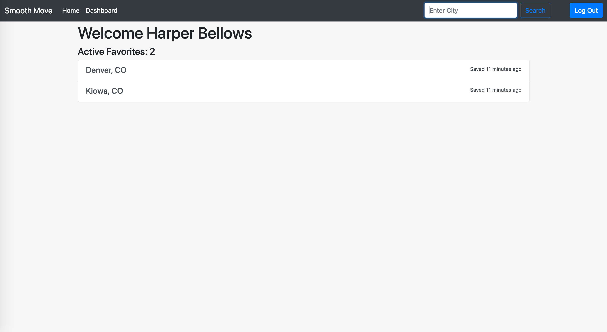

[](https://www.ruby-lang.org/en/)
[](https://rubyonrails.org/)
[](https://circleci.com/gh/hbellows/smooth_move)
[](https://codeclimate.com/github/hbellows/smooth_move/maintainability)
[](https://codecov.io/gh/hbellows/smooth_move)


# Smooth Move


## Table of Contents

* [Description/Purpose](#descriptionpurpose)
* [System Requirements](#system-requirements)
* [Initial Setup](#initial-setup)
* [Running Tests](#running-tests)
* [Dependencies](#dependencies)
* [Screenshots](#screenshots)
    * [Home Page](#home-page)
    * [City View](#city-view)
    * [City Search](#city-search)
    * [User Dashboard](#user-dashboard)
* [How To Contribute](#how-to-contribute)
* [Contributors/Developers](#contributorsdevelopers)

## Description/Purpose
This application was developed for the final project assignment for Turing School's Backend Engineering Program.  More information about this assignment can be found [here](http://backend.turing.io/module4/projects/take_home_challenge/take_home_challenge_spec).

View the project board for this application [here](https://github.com/hbellows/smooth_move/projects/1)

The specfic assignment required the student to build a fullstack application according to the following specification:
```
Create a tool that people who are considering moving can get some data points on for a prospective city:

- What is the cost of living?
- What is the population? 
- At least 2 more considerations, from the following or based on your own ideas:
    - What is the walkability score? Bike-ability score?
    - Proximity to airport
    - Cost of vehicle registration
    - Cost of gas

- Users should be able to "favorite" and "eliminate" cities, and see their master list of favorites. If they re-search for an eliminated city, they should still be able to access the data but should receive a friendly reminder that they eliminated it. Consider how you will make sure all of the numbers are put into perspective for your user, so that they all have meaning. 
This API should help you get started - https://public.opendatasoft.com/explore/dataset/1000-largest-us-cities-by-population-with-geographic-coordinates/api
```


## System Requirements
Please note: This application uses GitHub for Oauth, so you'll likely need to grab your own GitHub developer keys prior to using this application.

More information about GitHub developer keys can be found in the [GitHub developer docs](https://developer.github.com/v3/).

 - Ruby >= 2.4.1
 - Rails >= 5.2.1
 - Your own GitHub API key is needed to run the tests.
 - Please see the following section for instructions on handling personal api keys.

## Inital Setup
1. Clone or fork this project to your local machine.
2. Run `bundle` in the project folder.
3. Run `figaro install` in the project folder.
4. Add the following API keys to config/application.yml with the variable names exactly as shown:
   - `GITHUB_API_KEY`
5. Run `rails db:{create,migrate,seed}` in the project folder.
6. To use the application locally, run `rails s` and navigate to `http:localhost:3000`
7. Or, go [here](https://smooth-move-1.herokuapp.com/) to see the application live

## Running Tests
Run `rspec` to run the full test suite, or `rails server` to load up the application.
## Dependencies

 ### All Environments
 [Rails](https://guides.rubyonrails.org/)
 
 [Postgresql](https://www.postgresql.org/)
 
 [Puma](https://github.com/puma/puma)
 
 [Bootsnap](https://github.com/Shopify/bootsnap)
 
 [Faraday](https://github.com/lostisland/faraday)
 
 [Figaro](https://github.com/laserlemon/figaro)
 
 [Fast_jsonapi](https://github.com/Netflix/fast_jsonapi)
 
 [Jason Web Token for Ruby](https://github.com/jwt/ruby-jwt)
 
 ### Development
 [Rspec for Rails](https://github.com/rspec/rspec-rails)
 
 [Capybara](https://github.com/teamcapybara/capybara)
 
 [Factory Bot for Rails](https://github.com/thoughtbot/factory_bot_rails)
 
 [Pry for Rails](https://github.com/rweng/pry-rails)
 
 [Awesome Print](https://github.com/awesome-print/awesome_print)
 
 [Fuubar](https://github.com/thekompanee/fuubar)
 ### Test
 [VCR](https://github.com/vcr/vcr)
 
 [Webmock](https://github.com/bblimke/webmock)
 
 [Shoulda-Matchers](https://github.com/thoughtbot/shoulda-matchers)
 
 [Database Cleaner](https://github.com/DatabaseCleaner/database_cleaner)
 
 [Simplecov](https://github.com/colszowka/simplecov)
  

# How to Contribute
GitWired is an open source project. We invite your participation through issues and pull requests! 

When adding or changing a service please add tests.

Issues needing additional support:
- Desperately needs styling love!

## Screenshots

### Home Page


### City View



### City Search



### User Dashboard



## Known Issues
One small issue remaining: Removing the Oauth sign in link from the home page once a user has logged in.

## Contributors/Developers
This project was submitted by [Harper Bellows](@hbellows)

